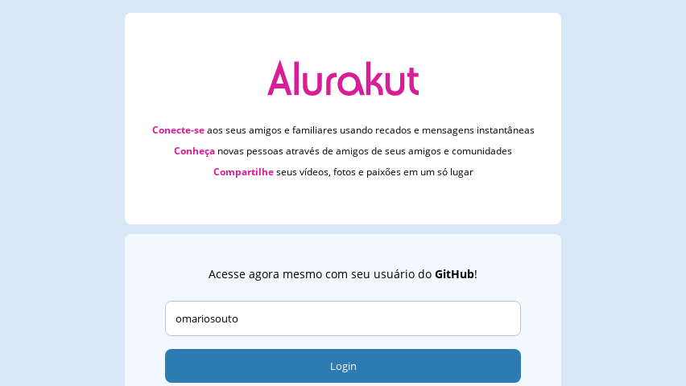

<h1 align="center">
  💬 AluraKut 💬
</h1>

<p align="center">
   

  

  

  <br>
  
  <a href="https://www.codacy.com/manual/Gabriel4420/alurakut?utm_source=github.com&amp;utm_medium=referral&amp;utm_content=Gabriel4420/alurakut&amp;utm_campaign=Badge_Grade">
    
  </a>
  
  


  <a href="https://www.linkedin.com/in/gabriel-rodrigues-perez-2069b072/">
    
  </a>
</p>

---

<p align="center">
  
</p>

---

# Indice

- :rocket: [Sobre o Projeto](#rocket-sobre-o-projeto)
- 👨‍💻️ [Tecnogias utilizadas](#%EF%B8%8F-tecnogias-utilizadas)
- 📦️ [Como utilizar o projeto](#%EF%B8%8F-como-utilizar-o-projeto)
---

## :rocket: Sobre o Projeto

A proposta da alurakut, é como iniciar e dar 
get started em um projeto NextJS, além de aprofundar
em conhecimentos essenciais em projetos javascript.

---

## 👨‍💻️ Tecnogias utilizadas

O projeto foi desenvolvido utilizando as seguintes tecnologias:

- [Javascript](https://www.alura.com.br/artigos/next-js-vantagens?gclid=CjwKCAjwos-HBhB3EiwAe4xM9zi7vMs0t7T6jwTcwl18GhhQkKL-tZiG6n6qL2M9xBC9j7FexChPLxoCACYQAvD_BwE)


### Dependências

  - [datocms](https://www.datocms.com)
  - [jsonwebtoken](https://www.npmjs.com/package/jsonwebtoken)
  - [next](https://www.alura.com.br/artigos/next-js-vantagens?gclid=CjwKCAjwos-HBhB3EiwAe4xM9zi7vMs0t7T6jwTcwl18GhhQkKL-tZiG6n6qL2M9xBC9j7FexChPLxoCACYQAvD_BwE)
  
  - [nookies](https://www.npmjs.com/package/nookies)
  - [styled-components](https://styled-components.com/docs/basics)


### Padronização de código

  - [ESLint](https://eslint.org/)
  - [Prettier](https://prettier.io/)
  - [babel](https://babeljs.io)

### IDE

  - [Visual Studio Code](https://code.visualstudio.com/)

---

## 📦️ Como utilizar o projeto

Para copiar o projeto, utilize os comandos:

```bash
  # Clonar o repositório
  ❯ git clone https://github.com/Gabriel4420/alurakut.git

 
```
Para instalar as dependências e iniciar o projeto, você pode utilizar o yarn ou npm:

**Utilizando yarn**

```bash
  # verificar as dependências
  ❯ yarn install
   
  # Iniciar o projeto
  ❯ yarn dev
```

**Utilizando npm**


```bash
  # Atualizar as dependências
  ❯ npm install

  # Iniciar o projeto
  ❯ npm run dev
```

---

<h4 align="center">
  Feito com ❤️ por Gabriel Rodrigues 👋️ <a href="mailto:gabriel_rodrigues_perez@hotmail.com">Entre em contato!</a>
</h4>

<p align="center">

  <a href="https://www.linkedin.com/in/gabriel-rodrigues-perez-2069b072/">
    
  </a>
  <a href="https://www.facebook.com/gabriel.rodrigues.perez">
    
  </a>
  <a href="https://www.instagram.com/gabriel_rodrigues_perez/">
    
  </a>
  
  
</p>